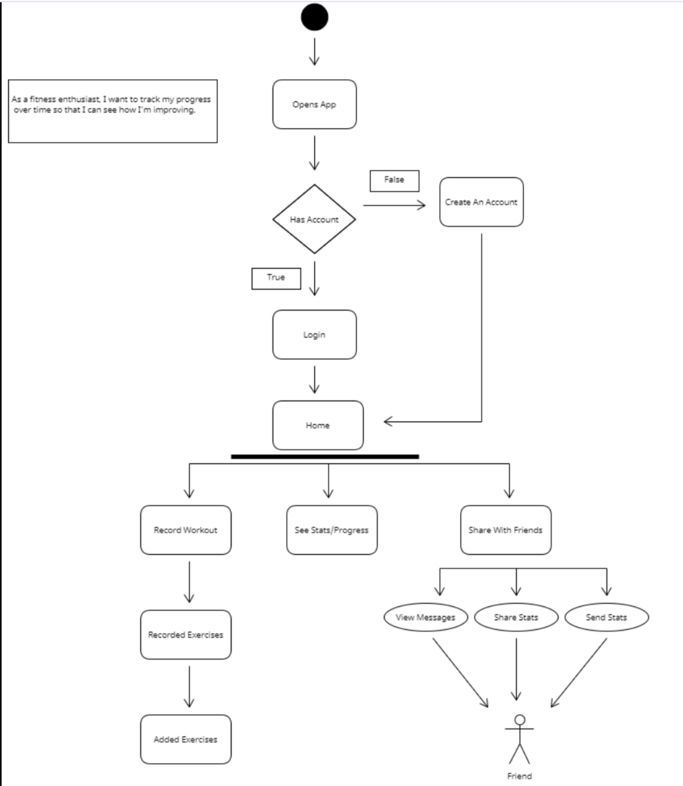
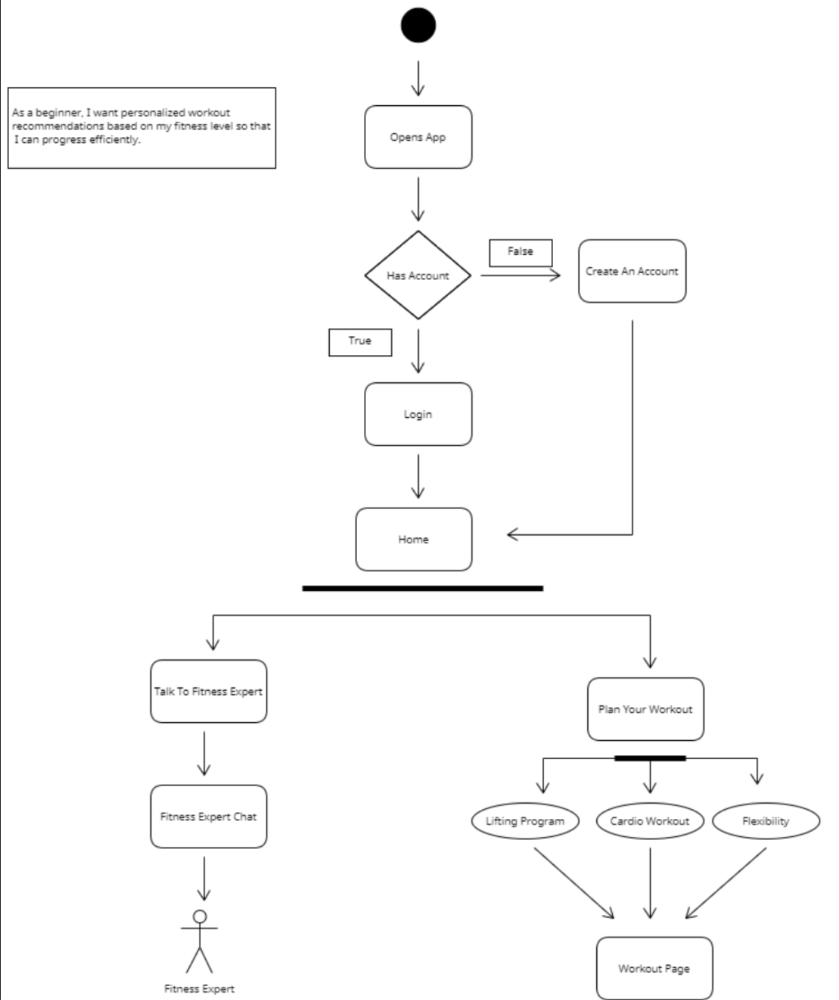

# Specification Phase Exercise

A little exercise to get started with the specification phase of the software development lifecycle. See the [instructions](instructions.md) for more detail.

## Team members

- Ian Pompliano: <https://www.github.com/ianpompliano>
- Obinna Nwaokoro: <https://www.github.com/ocnwaokoro>
- Marko Todorovic: <https://github.com/mtodorovic27>
- Sanskriti Gupta: <https://github.com/sanskritig08>

## Stakeholders

**Stakeholder: Will Novak**  
*Description*: Will is a computer science major at UVA with a passion for outdoor activities and sports. Even though he is busy at school, he values any opportunity to get outside and stay active when time allows.

### Goals:
- Create an organized workout schedule
- Track progress over time
- Consult with fitness experts and coaches
- Share workouts / progress with friends

### Frustrations:
- Constant notifications / reminders from other apps
- Lack of personalization (fitness level, goals, equipment)
- Feature paywalls
- Complicated UI

## Product Vision Statement

To make health and fitness easy for everyone.

## User Requirements

- As a working professional, I want a simple interface so that I can quickly plan my workout.

- As a beginner, I want personalized workout recommendations based on my fitness level so that I can progress efficiently.

- As a frequent gym-goer, I want the ability to input the equipment I have access to so that the app suggests workouts that I am equipped for.

- As a fitness enthusiast, I want to track my progress over time so that I can see how I’m improving.

- As a socialite, I want to share my workouts and progress with friends so that we can encourage and compete with each other.

- As a goal-oriented person, I want to set specific fitness goals and receive personalized plans so that I can stay on track to achieve them.

- As someone who dislikes interruptions, I want to control how often the app sends me reminders so that I’m not overwhelmed with unnecessary notifications.

- As a user on a budget, I want core features to be available for free so that I don’t have to pay for basic functionality.

- As an advanced athlete, I want to consult with fitness experts and coaches so that I can improve my performance.

- As a frequent traveler, I want workouts that are flexible to different environments so that I can stay active wherever I am.

## Activity Diagrams

****************************************************************************

## Clickable Prototype
[Clickable Protype](https://www.figma.com/proto/pbRY6IGHZGX6ccITl4KqNr/SE-Project-%231?node-id=122-127&node-type=canvas&t=SvlQ0GKfKolRl8Nu-0&scaling=min-zoom&content-scaling=fixed&page-id=0%3A1&starting-point-node-id=122%3A127)

[Design Canvas](https://www.figma.com/design/pbRY6IGHZGX6ccITl4KqNr/SE-Project-%231?node-id=0-1&t=InNZYEPLfvAnuJ0Q-1)
